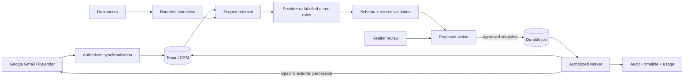

# Architecture

Additional transaction/approval decisions from the continuation audit are documented in [review and failure boundaries](review-failure-audit.md).

## Product flow

## Decisions

Database dependencies use FastAPI's function scope, committing before response headers and session cookies are sent. This prevents a follow-up browser request from racing an uncommitted session and allows commit failures to return an error. See [FastAPI dependency scopes](https://fastapi.tiangolo.com/tutorial/dependencies/dependencies-with-yield/#early-exit-and-scope).

**Modular monolith:** FastAPI serves versioned endpoints and the built React assets. Separate routers cover identity, CRM, work and account lifecycle. Services handle actions, intelligence, Google, billing, documents and jobs. This avoids premature service boundaries while separating API and background execution operationally.

**Python + TypeScript:** Pydantic validates inputs and provider output; SQLAlchemy models relational state; React and TypeScript provide a typed interaction layer. PostgreSQL is the production database. SQLite is restricted to development/test workloads. Alembic migrations freeze schema changes. The frontend uses TanStack Query for server state and an explicit API client; it does not persist customer records in browser storage.

**Frontend builds:** esbuild produces hashed ES modules, lazy route chunks and CSS; Vite is the optional hot-reload development server. A direct synchronous CLI build works in Windows environments that prohibit persistent child-process IPC. Source code is shared; there is no separate mock frontend.

**Queue in the database:** Jobs and approved actions commit together. Workers atomically claim due records, retry bounded failures, and retain dead jobs. One worker is the deployment default. External side effects cannot be made transactionally atomic with SQL; their execution claim is committed before the network call and ambiguous outcomes require reconciliation.

**Authorization:** Sessions resolve user membership on every request. Tenant-scoped ORM criteria, write guards, composite foreign keys and central RBAC defend organization boundaries. Identity discovery, Stripe customer mapping and worker scheduling are explicit privileged exceptions. Raw SQL is not available to natural-language queries. Database RLS is not enabled; see security documentation for the remaining defense-in-depth work.

**Evidence over inference:** Confirmed preferences and unverified extraction are distinct records. Matching uses only recorded preferences and reports unknown/conflicting criteria. AI summaries stay labelled analysis. An approval records the exact payload and actor; editing requires another review.

**Operational boundaries:** API and worker share an image and database. Azure Blob stores documents in production. Provider APIs are reached only at hardcoded official service origins. Google account ownership is checked before Calendar mutations. Teams share CRM visibility within an organization; this is not a per-agent private inbox product.

## Decisions from the authority audit

- Preserve the modular monolith and existing provider interfaces. Concrete defects were fixable incrementally without adding services or dependencies.
- Bind OAuth credentials to the initiating workspace and current member/session authority after the network boundary.
- Bind CRM approval digests to the fields' reviewed values. Execution refuses to overwrite a later edit; undo validates the complete resulting preference range. All preference writers lock the always-present contact, including first-row creation, with a portable unchanged write (SQLite has no row-level SELECT FOR UPDATE).
- Version queued approval jobs so an old delivery cannot act on a later review. Terminal approval failures become visible failed actions; a human must return and approve them again. Uncertain external delivery remains quarantined.
- Persist a workspace checkout attempt before the provider call; external state is reconciled, never guessed from a timeout or redirect.
- Treat the stored demo-tenant flag as an independent external-service boundary, even when runtime settings change.

These decisions prioritize existing workflow integrity over additional screens. Current verification and remaining dependencies live in [project status](project-status.md).
